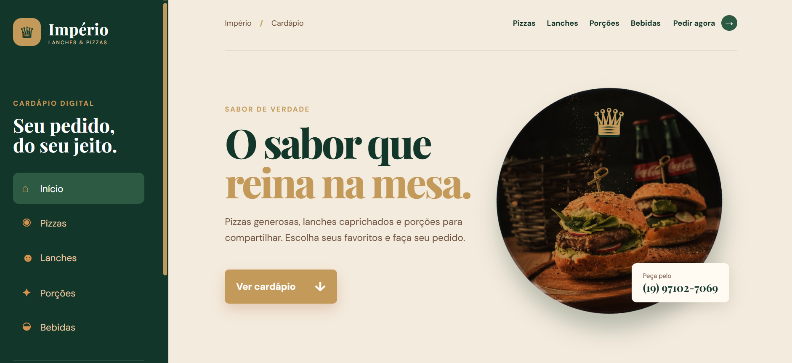

# 🍔 Cardápio Responsivo

Projeto de um cardápio digital responsivo desenvolvido como projeto de extensão, com foco na aplicação prática de conhecimentos em HTML5 e CSS3.

## Preview

## Tecnologias

* HTML5
* CSS3

## Funcionalidades

* Interface responsiva
* Organização do cardápio por categorias
* Apresentação dos produtos
* Navegação entre as diferentes seções
* Adaptação para diferentes dispositivos
* Encaminhamento para canais de contato e redes sociais
* Acesso à localização do estabelecimento
* Redirecionamento para plataforma de pedidos

## Objetivo

Desenvolver um projeto prático aplicando conceitos de desenvolvimento web, estruturação de páginas, estilização e responsividade com HTML5 e CSS3.
